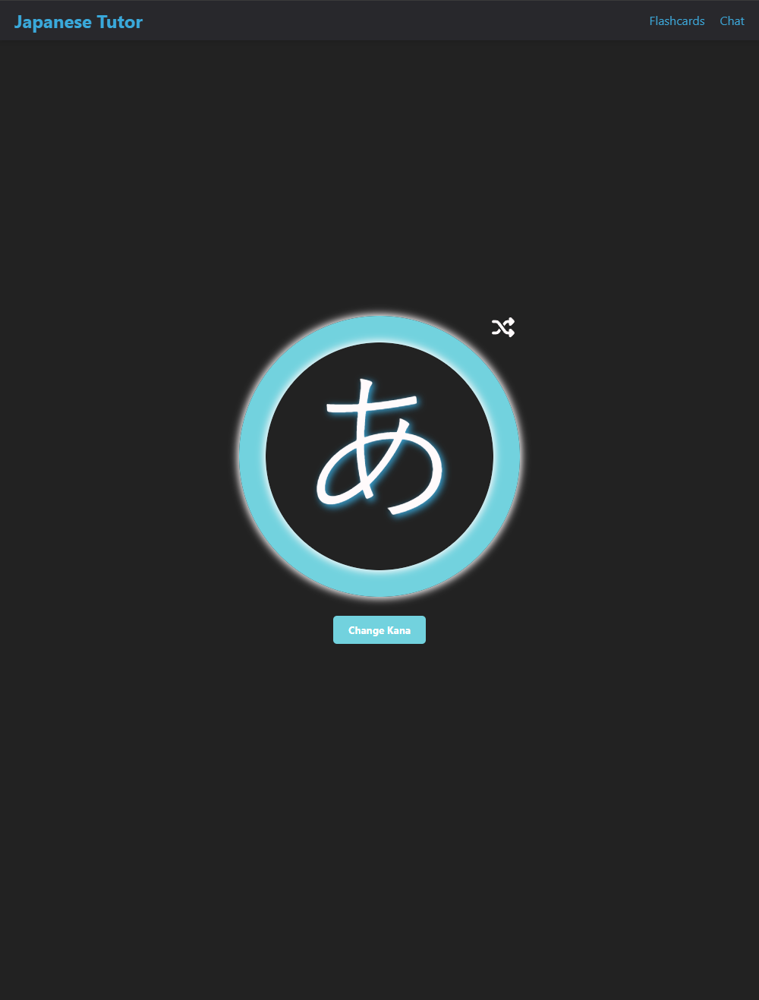

# AI Japanese Tutor

## Overview

Welcome to AI Japanese Tutor, a dynamic educational tool designed to enhance your Japanese learning experience. This application integrates interactive flashcards and a sophisticated AI chatbot, utilizing modern web technologies to provide an engaging and effective learning environment.

<!--  -->

## Features

### Flashcards
- **Interactive Flashcards**: Master Hiragana, Katakana, and Kanji with our intuitive flashcards. You can shuffle cards, navigate through them with simple swipes, and customize your learning session by selecting specific character sets.
- **Swipe Functionality**: Easily swipe right to advance to the next card or left to review the previous card.
- **Customization Options**: Use the shuffle icon to randomize the flashcards or select specific character sets for targeted practice.

### AI Chatbot
- **Interactive AI Chat**: Engage in real-time conversations with our AI chatbot to practice your Japanese. The chat supports text input and provides responses in both Japanese and English.
- **Translation Feature**: Click on any response from the AI to toggle between Japanese and English translations, helping you better understand the nuances of the conversation.

## Getting Started

### Prerequisites

Before you begin, make sure you have installed:
- Node.js
- npm (Node Package Manager)

### Installation

1. **Clone the repository:**
   ```bash
   git clone https://github.com/LRodriguez92/ai-japanese-tutor.git
   cd ai-japanese-tutor
    ```

2. Install dependencies:
    ```bash
    npm install
    ```

3. Run the application:
    ```bash
    npm start
    ```

This command will launch the app in development mode. Visit http://localhost:3000 to view it in your browser. The page will automatically reload if you make any changes.

### Usage

#### Flashcards
Access the flashcards by navigating to the `/flashcards` route.



#### AI Chat
Interact with the AI chatbot by visiting the `/chat` route. This is an excellent way to practice your conversational skills.


## Contributing

Your contributions can greatly enhance the AI Japanese Tutor and are very much appreciated.

1. Fork the Project
2. Create your Feature Branch (`git checkout -b feature/AmazingFeature`)
3. Commit your Changes (`git commit -m 'Add some AmazingFeature'`)
4. Push to the Branch (`git push origin feature/AmazingFeature`)
5. Open a Pull Request

## License

This project is distributed under the MIT License - see the LICENSE file for more information.

## Contact

Leo - contact@codedbyleo.com

Project Link: [https://github.com/LRodriguez92/ai-japanese-tutor](https://github.com/LRodriguez92/ai-japanese-tutor)
